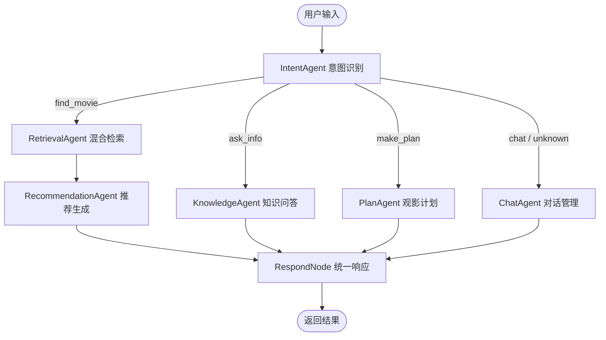

# 腾讯视频智能观影助手

基于 **LangGraph** 构建的多 Agent 智能观影助手，面向腾讯视频用户的“**找片难、疑问多、计划乱**”三大痛点，提供智能观影推荐、影视知识问答、观影计划制定一站式服务。

## 当前状态

项目主体已完成，包含后端 API、Streamlit 前端、LangGraph 多 Agent 工作流、SQLite/Chroma/Neo4j 数据层、完整文档与测试报告。

| 模块 | 状态 |
|------|------|
| 模拟数据生成与入库 | 已完成 |
| SQLite + Chroma 检索数据层 | 已完成 |
| Neo4j 知识图谱代码与 SQLite 兜底 | 已完成 |
| Intent / Retrieval / Knowledge / Plan / Chat / Recommendation Agent | 已完成 |
| LangGraph 工作流与 MemorySaver 多轮记忆 | 已完成 |
| FastAPI 后端接口 | 已完成 |
| Streamlit 前端界面 | 已完成 |
| 用户手册、开发文档、测试报告 | 已完成 |
| 单元 / 集成 / E2E / 性能 / 边界测试 | 195 项通过 |

## 核心功能

- **智能找片**：理解模糊描述，按类型、演员、年代、评分、地区等条件混合检索。
- **影视知识问答**：查询演员作品、导演信息、视频详情等影视知识。
- **观影计划制定**：根据时间、心情、偏好自动编排观影计划。
- **多轮对话**：通过 `thread_id` 与 `MemorySaver` 保留同一会话上下文。
- **可视化前端**：Streamlit 双面板界面，左侧对话，右侧展示推荐、知识或计划详情。
- **可观测调试**：支持 LangSmith 全链路追踪。

## 技术栈

| 层级 | 技术 |
|------|------|
| 工作流编排 | LangGraph (`StateGraph` + Nodes + Edges + `MemorySaver`) |
| LLM 集成 | LangChain + LangGraph + langchain-openai |
| LLM 模型 | DeepSeek `deepseek-v4-flash`（OpenAI 兼容 API） |
| API 服务 | FastAPI |
| 前端 | Streamlit |
| 关系存储 | SQLite |
| 向量检索 | Chroma + `all-MiniLM-L6-v2` embedding |
| 知识图谱 | Neo4j（服务不可用时自动降级 SQLite） |
| 追踪调试 | LangSmith |
| 测试 | pytest，195 项测试 |

## 快速开始

```bash
# 1. 安装依赖
pip install -r tencent_video_agent/requirements.txt

# 2. 配置环境变量
cp tencent_video_agent/.env.example tencent_video_agent/.env
# 编辑 tencent_video_agent/.env，填入 DeepSeek / LangSmith / Neo4j 等配置

# 3. 初始化数据库
cd tencent_video_agent
python db/init_db.py

# 4. 运行测试
python -m pytest tests/ -v

# 5. 启动 API 服务
python main.py

# 6. 启动前端（新终端）
streamlit run frontend/app.py
```

启动后访问：

- API 服务：`http://localhost:8001`
- 前端界面：`http://localhost:8501`
- 健康检查：`http://localhost:8001/health`

## 多 Agent 工作流



共享状态 `AgentState` 包含 `messages`、`user_intent`、`intent_confidence`、`retrieved_videos`、`knowledge_result`、`plan`、`response`、`errors` 等字段。每个节点通过 `safe_node` 做异常兜底，最终由 `respond_node` 汇总输出。

## LLM 与规则的分工

项目后续优化已将输入理解层 LLM 化：

- `IntentAgent`：LLM 意图分类。
- `ChatAgent`：LLM 对话生成。
- `KnowledgeAgent`：LLM 查询类型识别 + RAG 回答生成。
- `PlanAgent`：LLM 参数提取 + 模板化计划编排。

工具层保留规则和模板：

- `RetrievalAgent.parse_query` 保留关键词/正则，用于年份、评分、类型、演员、地区等结构化参数提取。
- `RecommendationAgent` 保留模板生成推荐理由，避免逐条调用 LLM 带来高延迟。

## 项目结构

```text
movieCompanion/
├── AGENTS.md                 # 当前开发计划与进度追踪
├── CLAUDE.md                 # Claude 版开发计划与进度追踪
├── PROJECT_GUIDE.md          # 项目指导手册
├── README.md                 # 项目总览
├── 项目进度/                  # 阶段计划与学习笔记
├── src/                      # 旧代码，待清理
└── tencent_video_agent/
    ├── agents/               # 多 Agent 实现
    ├── api/                  # FastAPI 路由
    ├── data/                 # 模拟数据与本地数据库
    ├── db/                   # SQLite / Chroma 初始化与访问
    ├── docs/                 # 用户手册、开发文档、测试报告、项目经验
    ├── frontend/             # Streamlit 前端
    ├── graph/                # LangGraph 状态、节点、工作流
    ├── knowledge_graph/      # Neo4j schema 与查询
    ├── tests/                # 195 项测试
    ├── tools/                # 检索、知识与 LangChain tools
    ├── utils/                # LLM client 与 Prompt 模板
    ├── main.py               # 后端启动入口
    └── requirements.txt
```

## 文档

- [项目指导手册](PROJECT_GUIDE.md)
- [开发计划与进度追踪](AGENTS.md)
- [用户手册](tencent_video_agent/docs/用户手册.md)
- [开发文档](tencent_video_agent/docs/开发文档.md)
- [测试报告](tencent_video_agent/docs/测试报告.md)
- [项目经验](tencent_video_agent/docs/项目经验.md)

## 测试

```bash
cd tencent_video_agent
python -m pytest tests/ -v
```

测试覆盖 Agent、检索工具、知识工具、LangGraph 工作流、FastAPI 接口、E2E 路径、性能基准与边界情况，当前进度文档记录为 **195/195 全部通过**。
