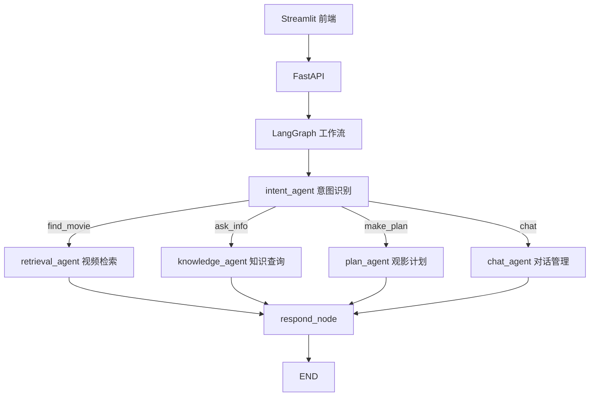

# 腾讯视频智能观影助手

基于 LangGraph 的多 Agent 智能观影助手，解决"找片难、疑问多、计划乱"三大痛点。

## 功能特性

- **找片推荐** — 模糊描述自动理解，按类型/演员/年代/评分混合检索
- **影视知识** — 演员作品、导演信息、视频详情随问随答
- **观影计划** — 自动编排观影计划（时间线 + 推荐理由 + 总时长）
- **多轮对话** — 上下文累积，同一会话内连续追问
- **可视化界面** — Streamlit 双面板界面（左对话 + 右详情）

## 快速开始

```bash
# 1. 安装依赖
pip install -r requirements.txt

# 2. 复制环境变量
cp .env.example .env

# 3. 初始化数据库（100 部视频 + 60 演员 + 30 导演）
python db/init_db.py

# 4. 启动 API 服务
python main.py

# 5. 浏览器打开 http://localhost:8501
streamlit run frontend/app.py
```

## 项目架构



## 技术栈

| 层 | 技术 |
|----|------|
| 工作流编排 | LangGraph (StateGraph + MemorySaver) |
| 后端框架 | FastAPI |
| 前端界面 | Streamlit |
| 关系存储 | SQLite |
| 向量检索 | Chroma (all-MiniLM-L6-v2) |
| 知识图谱 | Neo4j（可选，自动降级 SQLite） |
| 追踪调试 | LangSmith |
| 测试 | pytest (195 项测试全部通过) |

## 项目结构

```
tencent_video_agent/
├── agents/             # 5 个 Agent
├── api/                # FastAPI 路由
├── data/               # 模拟数据生成脚本
├── db/                 # 数据库（SQLite + Chroma）
├── docs/               # 用户手册 + 开发文档 + 测试报告
├── frontend/           # Streamlit 前端界面
├── graph/              # LangGraph 工作流核心
├── knowledge_graph/    # Neo4j 知识图谱
├── tools/              # 检索 + 知识工具
├── tests/              # 195 项测试
├── main.py             # 一键启动
├── .env.example        # 环境变量模板
└── README.md           # 本文件
```

## 启动方式

需要两个终端窗口：

```bash
# 终端 1：API 服务
python main.py

# 终端 2：前端界面
streamlit run frontend/app.py
```

## 测试

```bash
python -m pytest tests/ -v
```

当前共 **195 项测试**，覆盖所有模块（Agent、工作流、API、E2E、边界、性能）。

## 文档

- [用户手册](docs/用户手册.md) — 面向终端用户的操作指南
- [开发文档](docs/开发文档.md) — 面向开发者的技术文档
- [测试报告](docs/测试报告.md) — 测试结果汇总
