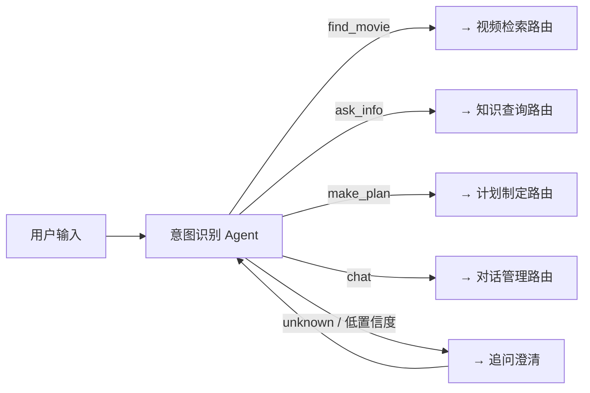

# Week2 D1-2：用户意图识别 Agent 模块

> **状态**：待执行 | **预计工时**：2 天
> **前置依赖**：D4-D5（环境搭建 ✅ | SQLite + Chroma 数据就绪 ✅）
> **交付物**：3 个核心 Agent 初步实现（意图识别 + 基类框架 + 对话管理）

---

## 一、任务概述

1. 设计 Agent 基类框架（所有 Agent 的公共抽象层）
2. 实现用户意图识别 Agent（多轮对话分类：找片/咨询/计划/闲聊）
3. 实现对话管理 Agent（多轮对话上下文维护 + 闲聊回应）
4. 设计结构化 Prompt 模板（System Prompt + Few-shot Examples + Tools 定义）

---

## 二、架构设计

### 2.1 Agent 基类框架

```
agents/
├── __init__.py
├── base_agent.py         # Agent 基类（抽象类）
├── intent_agent.py       # 意图识别 Agent
└── chat_agent.py         # 对话管理 Agent
```

**BaseAgent 设计**：

```python
class BaseAgent(ABC):
    """所有 Agent 的基类"""

    name: str                          # Agent 名称
    system_prompt: str                 # System Prompt
    few_shot_examples: list[dict]      # Few-shot 示例
    tools: list[Callable]              # 可用工具列表

    @abstractmethod
    def process(self, state: AgentState) -> dict:
        """处理当前状态，返回状态更新"""
```

### 2.2 AgentState 统一状态定义（graph/state.py）

所有 Agent 共享的状态定义，在 `graph/state.py` 中统一管理：

```python
class AgentState(TypedDict):
    messages: Annotated[list, add_messages]   # 完整对话历史
    user_intent: str                          # 识别结果: find_movie / ask_info / make_plan / chat / unknown
    intent_confidence: float                  # 置信度 0-1
    retrieved_videos: list                    # 视频检索结果
    knowledge_result: dict                    # 知识查询结果
    plan: dict                                # 观影计划
    response: str                             # 最终回复
    errors: list[str]                         # 错误记录
    next: str                                 # 路由控制
```

### 2.3 LangSmith 集成

所有 Agent 调用通过 LangSmith 追踪，在初始化时配置：
```python
os.environ["LANGCHAIN_TRACING_V2"] = "true"
os.environ["LANGCHAIN_PROJECT"] = "tencent_video_agent"
```

---

## 三、意图识别 Agent 详细设计

### 3.1 意图分类体系

| 意图 | 标识符 | 触发场景 | 示例用户输入 |
|------|--------|----------|-------------|
| 找片 | `find_movie` | 想找电影/电视剧/综艺来看 | "推荐一部科幻片"、"有什么好看的悬疑剧" |
| 咨询 | `ask_info` | 询问影视相关知识 | "这个导演还拍过什么电影"、"介绍一下这个演员" |
| 计划 | `make_plan` | 制定观影计划 | "帮我规划周末看三部电影"、"做个观影清单" |
| 闲聊 | `chat` | 问候/寒暄/无关话题 | "你好"、"今天天气真好" |
| 未知 | `unknown` | 无法明确分类 | 低置信度时回退到此类别 |

### 3.2 System Prompt 设计

```
你是一个腾讯视频智能助手的意图识别引擎。
你的任务是对用户的输入进行意图分类，输出结构化的意图识别结果。

【分类规则】
1. find_movie - 用户想要找片、推荐、搜索视频内容
2. ask_info - 用户想咨询影视知识、演员/导演信息
3. make_plan - 用户想制定观影计划、清单
4. chat - 问候、寒暄、与视频无关的话题
5. unknown - 无法明确归类的输入

【输出格式】
你必须严格按 JSON 格式输出：
{"intent": "分类结果", "confidence": 0.95, "reason": "分类理由简述"}
```

### 3.3 Few-shot Examples

```
用户: "推荐几部好看的悬疑电影"
→ {"intent": "find_movie", "confidence": 0.98, "reason": "用户明确请求推荐电影"}

用户: "周星驰演过哪些电影？"
→ {"intent": "ask_info", "confidence": 0.95, "reason": "用户询问演员作品"}

用户: "帮我规划今晚看什么"
→ {"intent": "make_plan", "confidence": 0.90, "reason": "用户请求制定计划"}

用户: "你好，今天心情不错"
→ {"intent": "chat", "confidence": 0.85, "reason": "普通问候，无具体需求"}
```

### 3.4 处理流程



---

## 四、对话管理 Agent 详细设计

### 4.1 职责

- 维护多轮对话上下文（通过 LangGraph Memory）
- 处理闲聊类对话（问候、寒暄等）
- 在意图模糊时主动追问澄清
- 记录用户偏好（如喜欢的类型、演员等）

### 4.2 System Prompt 设计

```
你是一个腾讯视频智能助手的对话管理Agent。
你的职责包括：
1. 以友好、热情的语气回应用户的问候和闲聊
2. 在用户意图不明确时，主动询问用户需求
3. 记录对话中用户的偏好信息
4. 在适当时引导用户使用视频推荐功能

回答风格：亲切、专业、简洁。用中文回答。
```

### 4.3 闲聊回应策略

| 用户输入模式 | 回应策略 |
|-------------|---------|
| 问候（你好/嗨/早上好） | 友好问候 + 引导提问 |
| 感谢（谢谢/感谢） | 礼貌回应 + 继续服务 |
| 评价（好/不好/不错） | 确认反馈 + 追问需求 |
| 无关话题 | 礼貌回正 + 引导到影视话题 |

---

## 五、文件清单

| 文件 | 内容 | 状态 |
|------|------|------|
| `agents/__init__.py` | 包初始化 | 已存在 ✅ |
| `agents/base_agent.py` | Agent 基类抽象 | 待创建 |
| `agents/intent_agent.py` | 意图识别 Agent | 待创建 |
| `agents/chat_agent.py` | 对话管理 Agent | 待创建 |
| `graph/__init__.py` | 包初始化 | 已存在 ✅ |
| `graph/state.py` | AgentState 定义 | 待创建 |
| `tests/test_intent_agent.py` | 意图识别单元测试 | 待创建 |
| `tests/test_chat_agent.py` | 对话管理单元测试 | 待创建 |

---

## 六、任务分解与执行步骤

| 步骤 | 内容 | 预估时间 | 产出 |
|------|------|----------|------|
| 1 | 定义 AgentState 统一状态（graph/state.py） | 15min | 状态定义 |
| 2 | 编写 BaseAgent 基类（agents/base_agent.py） | 20min | 基类代码 |
| 3 | 设计意图识别 System Prompt + Few-shot | 20min | Prompt 模板 |
| 4 | 实现 IntentAgent（agents/intent_agent.py） | 30min | 意图识别 Agent |
| 5 | 设计对话管理 System Prompt | 15min | Prompt 模板 |
| 6 | 实现 ChatAgent（agents/chat_agent.py） | 25min | 对话管理 Agent |
| 7 | 编写意图识别单元测试 | 25min | 测试代码 |
| 8 | 编写对话管理单元测试 | 15min | 测试代码 |
| 9 | 运行全部测试验证 | 10min | 验证通过 |

> **总预计编码时间**：~3 小时

---

## 七、质量验收标准

- [ ] `AgentState` 包含全部必要字段，类型提示完整
- [ ] `BaseAgent` 抽象类定义清晰，子类可正确继承
- [ ] `IntentAgent.process()` 返回正确的意图分类和置信度
- [ ] 对 5 种意图（find_movie/ask_info/make_plan/chat/unknown）均有正确的分类逻辑
- [ ] 低置信度时可路由到澄清流程
- [ ] `ChatAgent` 可正确维护对话上下文
- [ ] 所有测试通过

---

## 八、技术决策

### 8.1 LLM 调用策略

由于当前阶段未配置本地 LLM，Agent 采用 **基于规则+关键词的意图识别** 作为初版实现：
- 关键词匹配（"推荐"/"找"/"有没有" → find_movie）
- 规则组合（多关键词加权判断）
- 后续可替换为 LLM 调用

### 8.2 LangSmith 集成

在 Agent 初始化时配置追踪：
```python
from langsmith import traceable

@traceable(name="intent_agent", run_type="chain")
def process(self, state):
    ...
```

---

## 九、后续衔接

- **W2 D3-4（视频检索系统）**：IntentAgent 的 find_movie 路由将对接视频检索 Agent
- **W2 D5（知识库构建）**：ask_info 路由将对接知识查询 Agent
- **W3（工作流集成）**：所有 Agent 将在 StateGraph 中编排运行

---

> **下一步**：确认计划后，开始实现 Agent 基类 + 意图识别 Agent + 对话管理 Agent。
