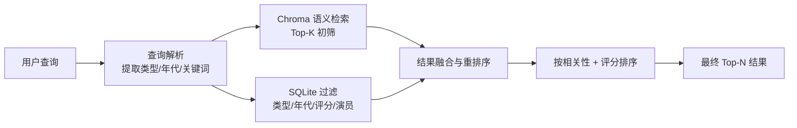

# Week2 D3-4：视频检索系统

> **状态**：待执行 | **预计工时**：2 天
> **前置依赖**：D4-D5（Chroma + SQLite 就绪 ✅）| W2 D1-2（BaseAgent + IntentAgent ✅）
> **交付物**：向量数据库 + 检索工具函数 + 视频检索 Agent

---

## 一、任务概述

1. 实现基于 Chroma 的语义检索工具（已搭建存储，需封装检索函数）
2. 实现基于 SQLite 的传统过滤工具（类型、年代、演员、评分过滤）
3. 将语义检索 + 传统过滤组合为**混合检索**流程
4. 实现视频检索 Agent（`agents/retrieval_agent.py`），接收意图 Agent 的 `find_movie` 路由

---

## 二、架构设计

### 2.1 检索流程



### 2.2 文件清单

| 文件 | 内容 | 状态 |
|------|------|------|
| `tools/search_tools.py` | 检索工具函数（语义/过滤/混合） | 待创建 |
| `agents/retrieval_agent.py` | 视频检索 Agent | 待创建 |
| `tests/test_retrieval_agent.py` | 检索 Agent 测试 | 待创建 |
| `tests/test_search_tools.py` | 检索工具测试 | 待创建 |

---

## 三、检索工具详细设计（`tools/search_tools.py`）

### 3.1 语义检索

基于已有 Chroma 封装的高级检索函数：

```python
def semantic_search(
    query: str,           # 用户查询文本
    n_results: int = 20,  # 返回数量
    type_filter: str | None = None,  # 类型过滤
    min_rating: float | None = None, # 最低评分
) -> list[dict]:
    """语义相似检索"""
```

- 复用 `db/chroma_db.py` 的 `search_similar()`
- 支持 `where` 过滤参数（类型、评分）
- 返回结果包含 video_id / title / score / type / year / rating

### 3.2 传统过滤

基于 SQLite 的结构化过滤：

```python
def filter_videos(
    genre: str | None = None,      # 类型：喜剧/动作/科幻等
    year_start: int | None = None, # 起始年份
    year_end: int | None = None,   # 截止年份
    actor_name: str | None = None, # 演员名
    director_name: str | None = None, # 导演名
    min_rating: float | None = None,  # 最低评分
    sort_by: str = "rating",       # 排序字段
    limit: int = 20,               # 限制条数
) -> list[dict]:
    """结构化条件过滤"""
```

- 使用 `db/sqlite_db.py` 中的查询函数
- 支持多条件组合过滤
- 按评分/年份排序

### 3.3 查询解析器

从用户查询中提取过滤条件：

```python
def parse_query(query: str) -> dict:
    """从自然语言查询中提取结构化过滤条件

    输入: "推荐2020年以后的喜剧片，评分高的"
    输出: {
        "keywords": "喜剧",
        "year_start": 2020,
        "genre": "喜剧",
        "min_rating": 8.0,
    }
    """
```

解析规则（基于关键词）：

| 提取目标 | 关键词模式 |
|---------|-----------|
| 类型 | 喜剧/动作/科幻/爱情/悬疑/剧情/古装/奇幻/刑侦/犯罪/恐怖/战争/动画/纪录片 |
| 年代 | (\d{4})年、(\d{4})年后、近(\d)年、最新、经典 |
| 评分 | 高分、评分高、8分以上、口碑好 |
| 演员 | 某演员/主演：xxx |
| 地区 | 国产/美剧/韩剧/日剧 |

### 3.4 混合检索

```python
def hybrid_search(query: str, n_results: int = 10) -> list[dict]:
    """混合检索：语义检索 + 传统过滤 + 结果融合

    策略：
    1. 先用 parse_query 提取结构化条件
    2. 执行 Chroma 语义检索
    3. 执行 SQLite 过滤
    4. 结果融合（优先保留同时出现在两个结果集中的条目）
    5. 重排序（综合语义分数 + 评分权重）
    """
```

---

## 四、检索 Agent 详细设计（`agents/retrieval_agent.py`）

### 4.1 职责

- 接收 IntentAgent 发出的 `find_movie` 路由
- 调用 `hybrid_search` 执行混合检索
- 对检索结果进行格式化、去重、排序
- 返回结构化的推荐结果列表

### 4.2 System Prompt

```
你是一个腾讯视频智能助手的视频检索Agent。
你的职责是根据用户的找片需求，从片库中检索最匹配的视频内容。

检索策略：
1. 理解用户偏好（类型、年代、演员等）
2. 调用混合检索工具获取候选列表
3. 对结果进行排序和过滤
4. 返回最相关的 Top-N 推荐

注意：如果检索结果为空，如实告知并引导用户调整条件。
```

### 4.3 处理流程

```
process(state):
  1. 从 messages 获取用户查询
  2. parse_query() 提取结构化条件
  3. hybrid_search() 执行混合检索
  4. 将结果写入 state["retrieved_videos"]
  5. 设置 next 路由到推荐生成 Agent（当前暂设为 __end__）
```

---

## 五、任务分解与执行步骤

| 步骤 | 内容 | 预估时间 | 产出 |
|------|------|----------|------|
| 1 | 编写 `parse_query()` 查询解析器 | 25min | 解析函数 |
| 2 | 编写 `semantic_search()` 语义检索封装 | 15min | 检索函数 |
| 3 | 编写 `filter_videos()` 传统过滤 | 20min | 过滤函数 |
| 4 | 编写 `hybrid_search()` 混合检索 | 20min | 混合检索 |
| 5 | 实现 `RetrievalAgent` 视频检索 Agent | 25min | Agent 实现 |
| 6 | 编写检索工具单元测试 | 20min | 测试代码 |
| 7 | 编写检索 Agent 单元测试 | 15min | 测试代码 |
| 8 | 运行全部测试验证 | 10min | 验证通过 |

> **总预计编码时间**：~2.5 小时

---

## 六、质量验收标准

- [ ] `parse_query()` 能正确提取类型、年代、评分等条件
- [ ] `semantic_search()` 返回结果的 score 合理排序
- [ ] `filter_videos()` 多条件组合过滤正确
- [ ] `hybrid_search()` 结果融合后质量优于单一检索
- [ ] `RetrievalAgent.process()` 正确填充 `retrieved_videos`
- [ ] 空结果 / 无效输入等边界情况处理正确
- [ ] 所有测试通过

---

## 七、后续衔接

- **W2 D5（知识库构建）**：ask_info 路由将对接知识查询 Agent
- **W3（工作流集成）**：检索 Agent 将作为 StateGraph 的一个 Node，与 IntentAgent 条件边相连

---

> **下一步**：确认计划后，开始实现检索工具函数 + 视频检索 Agent。
