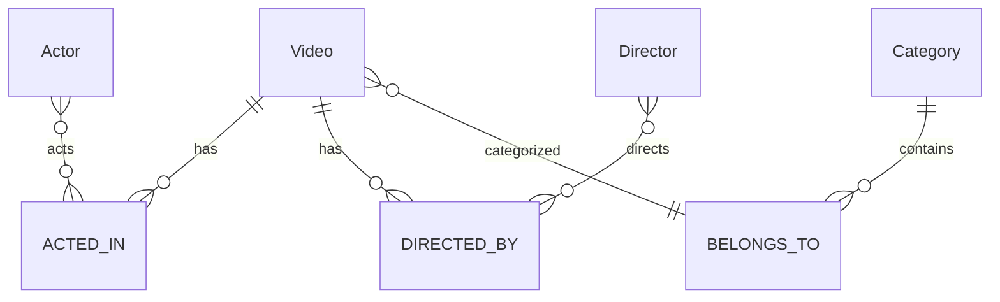
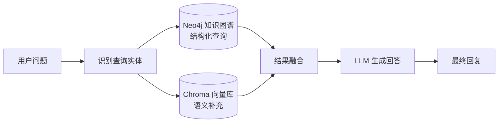

# Week2 D5：影视知识库构建（Neo4j + RAG）

> **状态**：待执行 | **预计工时**：1 天
> **前置依赖**：D3（模拟数据 ✅）| D4-D5（Neo4j 依赖已安装 ✅）
> **交付物**：知识库 + RAG 单元测试用例

---

## 一、任务概述

1. 设计 Neo4j 知识图谱数据模型（演员/导演/视频实体 + 关系）
2. 将 JSON 数据导入 Neo4j 构建知识图谱
3. 实现 Cypher 查询工具函数（演员作品、导演作品、实体关联等）
4. 实现知识查询 Agent（`agents/knowledge_agent.py`），接收 IntentAgent 的 `ask_info` 路由
5. 编写 RAG 检索功能（知识图谱 + 向量混合检索）

---

## 二、技术选型说明

Neo4j 是计划中的知识图谱存储，但启动 Neo4j 服务需要额外安装。为降低环境依赖，采用**双轨策略**：

| 方案 | 条件 | 说明 |
|------|------|------|
| **Neo4j 模式** | Neo4j 服务可用 | 完整知识图谱 + Cypher 查询 |
| **SQLite 兜底模式** | Neo4j 不可用 | 基于 SQLite 关联表模拟知识查询 |

Agent 启动时自动检测 Neo4j 连接状态，选择合适的后端。

---

## 三、Neo4j 知识图谱设计

### 3.1 数据模型



### 3.2 节点标签

| 标签 | 属性 |
|------|------|
| `Video` | video_id, title, year, rating, type, description |
| `Actor` | actor_id, name, gender, birth_year, nationality, popularity |
| `Director` | director_id, name, birth_year, nationality, popularity |
| `Category` | category_id, name |

### 3.3 关系类型

| 关系 | 语义 |
|------|------|
| `(Actor)-[:ACTED_IN]->(Video)` | 演员出演视频 |
| `(Director)-[:DIRECTED]->(Video)` | 导演执导视频 |
| `(Video)-[:BELONGS_TO]->(Category)` | 视频属于某分类 |

### 3.4 索引

```cypher
CREATE INDEX video_id_idx FOR (v:Video) ON (v.video_id);
CREATE INDEX actor_id_idx FOR (a:Actor) ON (a.actor_id);
CREATE INDEX director_id_idx FOR (d:Director) ON (d.director_id);
```

---

## 四、文件清单

| 文件 | 内容 | 状态 |
|------|------|------|
| `knowledge_graph/__init__.py` | 包初始化 | 已存在 ✅ |
| `knowledge_graph/kg_schema.py` | Neo4j 数据模型 + 导入脚本 | 待创建 |
| `knowledge_graph/kg_queries.py` | Cypher 查询函数 | 待创建 |
| `tools/knowledge_tools.py` | 知识查询工具（含 SQLite 兜底） | 待创建 |
| `agents/knowledge_agent.py` | 知识查询 Agent | 待创建 |
| `tests/test_knowledge_agent.py` | 知识查询测试 | 待创建 |
| `tests/test_knowledge_tools.py` | 知识工具测试 | 待创建 |

---

## 五、Cypher 查询设计（`kg_queries.py`）

### 5.1 查询函数

```python
def get_actor_films(actor_name: str) -> list[dict]:
    """查询演员参演作品"""
    # MATCH (a:Actor {name: $name})-[:ACTED_IN]->(v:Video)
    # RETURN v.title, v.year, v.rating ORDER BY v.year DESC

def get_director_films(director_name: str) -> list[dict]:
    """查询导演作品"""
    # MATCH (d:Director {name: $name})-[:DIRECTED]->(v:Video)
    # RETURN v.title, v.year, v.rating ORDER BY v.year DESC

def get_video_details(video_title: str) -> dict:
    """查询视频详细信息（含演员、导演、分类）"""
    # MATCH (v:Video {title: $title})
    # OPTIONAL MATCH (v)<-[:ACTED_IN]-(a:Actor)
    # OPTIONAL MATCH (v)<-[:DIRECTED]-(d:Director)
    # OPTIONAL MATCH (v)-[:BELONGS_TO]->(c:Category)
    # RETURN v, collect(DISTINCT a), collect(DISTINCT d), collect(DISTINCT c)

def get_actor_info(actor_name: str) -> dict:
    """查询演员信息（含参演作品数量、平均评分等）"""
    # MATCH (a:Actor {name: $name})-[:ACTED_IN]->(v:Video)
    # RETURN a, count(v) as film_count, avg(v.rating) as avg_rating

def search_by_keyword(keyword: str) -> list[dict]:
    """关键词搜索（模糊匹配标题/演员/导演名）"""
    # MATCH (n)
    # WHERE n.title CONTAINS $keyword OR n.name CONTAINS $keyword
    # RETURN n, labels(n)
```

### 5.2 SQLite 兜底查询（`tools/knowledge_tools.py`）

当 Neo4j 不可用时，使用 SQLite 关联表实现相同功能：

```python
def get_actor_films_sqlite(actor_name: str) -> list[dict]:
    """SQLite 兜底：查询演员参演作品"""

def get_director_films_sqlite(director_name: str) -> list[dict]:
    """SQLite 兜底：查询导演作品"""

def get_video_details_sqlite(video_title: str) -> dict:
    """SQLite 兜底：查询视频详细信息"""

def knowledge_search(query: str) -> dict:
    """自动检测 Neo4j 状态，选择合适的查询后端"""
```

---

## 六、知识查询 Agent 设计（`agents/knowledge_agent.py`）

### 6.1 职责

- 接收 IntentAgent 发出的 `ask_info` 路由
- 从用户查询中提取查询目标（演员/导演/视频title）
- 调用 knowledge_search 获取结果
- 格式化结果为自然语言回复

### 6.2 System Prompt

```
你是一个腾讯视频智能助手的知识查询Agent。
你的职责是回答用户关于影视知识的问题，包括演员信息、导演作品、视频详情等。

当用户询问演员/导演/视频信息时，调用知识库查询，
并以清晰、有条理的方式呈现查询结果。
```

### 6.3 处理流程

```
process(state):
  1. 从 messages 获取用户查询
  2. 识别查询类型：演员作品 / 导演作品 / 视频详情 / 知识问答
  3. 调用 knowledge_search() 执行查询
  4. 格式化结果
  5. 写入 state["knowledge_result"] 和 state["response"]
  6. 设置 next = "__end__"
```

---

## 七、RAG 检索

### 7.1 设计思路

对于知识类问题，RAG 流程为：



当前阶段（无 LLM）仅执行 KG + Vector 查询，并将结构化结果直接返回。

---

## 八、任务分解与执行步骤

| 步骤 | 内容 | 预估时间 | 产出 |
|------|------|----------|------|
| 1 | 设计 Neo4j 数据模型 + 编写导入脚本（kg_schema.py） | 25min | 图模型定义 |
| 2 | 编写 Cypher 查询函数（kg_queries.py） | 20min | 查询函数 |
| 3 | 编写 SQLite 兜底查询（tools/knowledge_tools.py） | 25min | 兜底查询 |
| 4 | 编写 knowledge_search 自动切换逻辑 | 15min | 统一查询入口 |
| 5 | 实现 KnowledgeAgent（agents/knowledge_agent.py） | 20min | Agent 实现 |
| 6 | 编写知识工具单元测试 | 20min | 测试代码 |
| 7 | 编写知识 Agent 单元测试 | 15min | 测试代码 |
| 8 | 运行全部测试验证 | 10min | 验证通过 |

> **总预计编码时间**：~2.5 小时

---

## 九、质量验收标准

- [ ] Neo4j 导入脚本可创建节点和关系（如 Neo4j 可用）
- [ ] Cypher 查询函数返回正确结果
- [ ] SQLite 兜底查询在无 Neo4j 时正常工作
- [ ] KnowledgeAgent 准确识别演员/导演/视频查询
- [ ] 查询结果格式化为易读的自然语言
- [ ] 空结果/无效输入边界情况处理正确
- [ ] 所有测试通过

---

## 十、后续衔接

- **W3（工作流集成）**：KnowledgeAgent 将作为 StateGraph 的一个 Node
- **W3（工作流优化）**：可接入真实 LLM 实现 RAG 生成式回答

---

> **下一步**：确认计划后，开始实现知识图谱 + RAG 检索。
