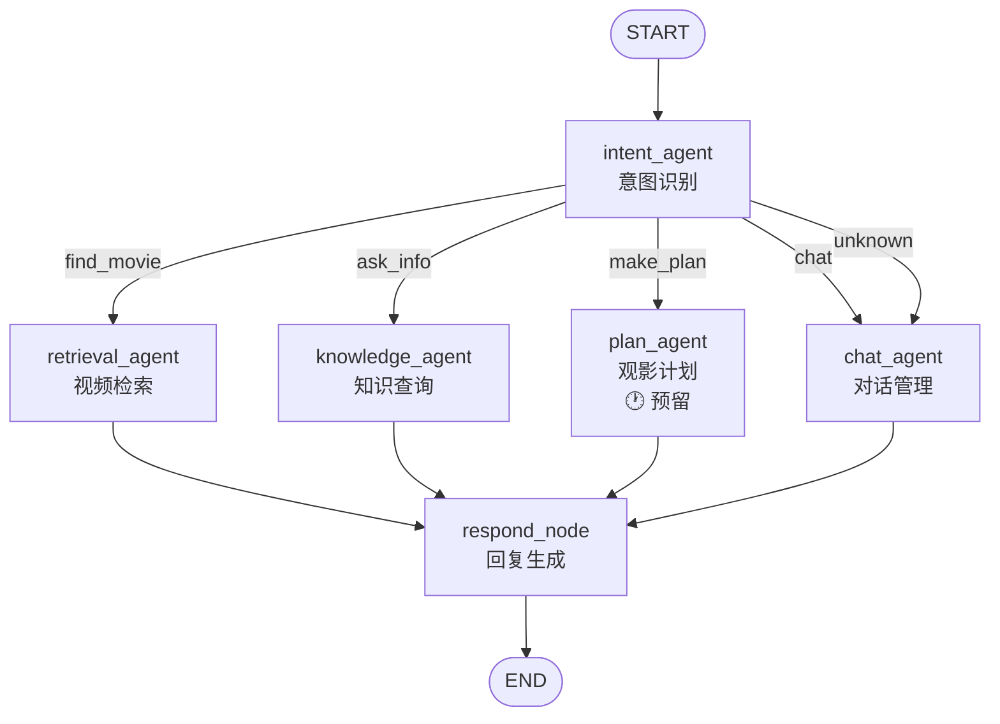

# Week3 D1-2：LangGraph 工作流集成 - 状态图设计

> **状态**：待执行 | **预计工时**：2 天
> **前置依赖**：Week2 全部完成 ✅（4 个 Agent + 3 个工具模块就绪）
> **交付物**：完整的 LangGraph 工作流

---

## 一、任务概述

1. 将已实现的 4 个 Agent（Intent / Retrieval / Knowledge / Chat）组装到 StateGraph 中
2. 设计节点间状态流转逻辑（条件边 + 普通边）
3. 实现工作流编译与记忆机制
4. 验证端到端工作流正确性

---

## 二、工作流架构

### 2.1 状态图



### 2.2 路由逻辑

```python
def route_after_intent(state: AgentState) -> str:
    """根据意图识别结果路由到对应 Agent"""
    intent = state.get("user_intent", "unknown")
    return intent  # find_movie / ask_info / make_plan / chat / unknown
```

所有 Agent 处理完成后，统一经过 `respond_node` 收集回复。

---

## 三、文件清单

| 文件 | 内容 | 状态 |
|------|------|------|
| `graph/__init__.py` | 包初始化 | 已存在 ✅ |
| `graph/state.py` | AgentState 定义 | 已存在 ✅ |
| `graph/nodes.py` | 工作流节点函数 | 待创建 |
| `graph/graph.py` | StateGraph 构建 + 编译 | 待创建 |
| `tests/test_workflow.py` | 端到端工作流测试 | 待创建 |

---

## 四、节点函数设计（`graph/nodes.py`）

每个节点包装对应 Agent 的 `process()` 方法：

```python
from agents.intent_agent import IntentAgent
from agents.retrieval_agent import RetrievalAgent
from agents.knowledge_agent import KnowledgeAgent
from agents.chat_agent import ChatAgent

intent_agent = IntentAgent()
retrieval_agent = RetrievalAgent()
knowledge_agent = KnowledgeAgent()
chat_agent = ChatAgent()

def intent_node(state: AgentState) -> dict:
    """意图识别节点"""
    return intent_agent.process(state)

def retrieval_node(state: AgentState) -> dict:
    """视频检索节点"""
    return retrieval_agent.process(state)

def knowledge_node(state: AgentState) -> dict:
    """知识查询节点"""
    return knowledge_agent.process(state)

def chat_node(state: AgentState) -> dict:
    """对话管理节点"""
    return chat_agent.process(state)

def respond_node(state: AgentState) -> dict:
    """回复生成节点 - 收集最终回复"""
    response = state.get("response", "")
    if not response:
        response = "请问有什么可以帮你的？"
    return {"response": response, "next": "__end__"}
```

---

## 五、工作流构建（`graph/graph.py`）

### 5.1 构建流程

```python
from langgraph.graph import StateGraph, START, END
from langgraph.checkpoint.memory import MemorySaver

from graph.state import AgentState
from graph.nodes import (
    intent_node,
    retrieval_node,
    knowledge_node,
    chat_node,
    respond_node,
)


def route_after_intent(state: AgentState) -> str:
    """根据意图路由到对应 Agent"""
    return state.get("user_intent", "unknown")


def build_graph() -> StateGraph:
    """构建并编译工作流"""

    builder = StateGraph(AgentState)

    # 注册节点
    builder.add_node("intent_agent", intent_node)
    builder.add_node("retrieval_agent", retrieval_node)
    builder.add_node("knowledge_agent", knowledge_node)
    builder.add_node("chat_agent", chat_node)
    builder.add_node("respond_node", respond_node)

    # 边：START → 意图识别
    builder.add_edge(START, "intent_agent")

    # 条件边：意图识别 → 各 Agent
    builder.add_conditional_edges(
        "intent_agent",
        route_after_intent,
        {
            "find_movie": "retrieval_agent",
            "ask_info": "knowledge_agent",
            "make_plan": "chat_agent",     # plan_agent 预留
            "chat": "chat_agent",
            "unknown": "chat_agent",
        },
    )

    # 普通边：各 Agent → 回复生成
    builder.add_edge("retrieval_agent", "respond_node")
    builder.add_edge("knowledge_agent", "respond_node")
    builder.add_edge("chat_agent", "respond_node")

    # 边：回复生成 → END
    builder.add_edge("respond_node", END)

    # 编译（含记忆机制）
    memory = MemorySaver()
    graph = builder.compile(checkpointer=memory)

    return graph
```

### 5.2 记忆机制

使用 LangGraph 内置的 `MemorySaver` 实现会话级记忆：

- `thread_id` 区分不同用户会话
- 自动保存对话历史到内存
- 后续可替换为 `SQLiteSaver` 实现持久化

### 5.3 运行示例

```python
def run_query(query: str, thread_id: str = "default") -> dict:
    """运行单次查询"""
    graph = build_graph()
    config = {"configurable": {"thread_id": thread_id}}
    result = graph.invoke(
        {"messages": [{"role": "user", "content": query}],
         "user_intent": "", "intent_confidence": 0.0,
         "retrieved_videos": [], "knowledge_result": {},
         "plan": {}, "response": "", "errors": [], "next": ""},
        config=config,
    )
    return result
```

---

## 六、路由表

| 意图 | 路由目标 | 后续节点 | 说明 |
|------|---------|---------|------|
| `find_movie` | `retrieval_agent` | `respond_node` | 视频检索 |
| `ask_info` | `knowledge_agent` | `respond_node` | 知识查询 |
| `make_plan` | `chat_agent` | `respond_node` | 预留，暂由 chat 接管 |
| `chat` | `chat_agent` | `respond_node` | 闲聊对话 |
| `unknown` | `chat_agent` | `respond_node` | 澄清追问 |

---

## 七、任务分解与执行步骤

| 步骤 | 内容 | 预估时间 | 产出 |
|------|------|----------|------|
| 1 | 编写节点函数（graph/nodes.py） | 15min | 节点包装 |
| 2 | 编写工作流构建（graph/graph.py） | 20min | StateGraph 定义 |
| 3 | 编写条件边路由函数 | 10min | 路由逻辑 |
| 4 | 添加 MemorySaver 记忆机制 | 10min | 会话记忆 |
| 5 | 编写 run_query 运行入口 | 10min | 调用接口 |
| 6 | 编写端到端工作流测试 | 25min | 测试代码 |
| 7 | 运行全部测试验证 | 10min | 验证通过 |

> **总预计编码时间**：~1.5 小时

---

## 八、质量验收标准

- [ ] 所有 4 个 Agent 正确注册为 StateGraph 节点
- [ ] 条件边根据意图正确路由到对应 Agent
- [ ] 所有路径最终到达 END
- [ ] MemorySaver 支持多轮对话（同一 thread_id 累积历史）
- [ ] 不同 thread_id 的会话相互隔离
- [ ] 端到端测试覆盖 find_movie / ask_info / chat / unknown 路径
- [ ] 全部测试通过

---

## 九、后续衔接

- **W3 D3-4（工作流优化）**：添加工具调用、优化 Agent 协作、接入 LangSmith
- **W3 D5（API 开发）**：用 FastAPI 封装整个 Graph

---

> **下一步**：确认计划后，开始实现 LangGraph 工作流集成。
