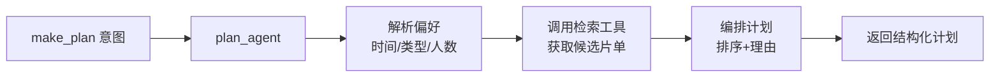

# Week3 D3-4：工作流优化与调试

> **状态**：已完成 ✅ | **预计工时**：2 天
> **前置依赖**：W3 D1-2 LangGraph 工作流集成 ✅（5 节点 StateGraph + MemorySaver）
> **交付物**：LangSmith 追踪 + Tool Calling + 优化后的工作流 + MakePlan Agent

---

## 一、任务概述

1. 集成 LangSmith 追踪 — 对工作流运行进行全链路监控
2. 实现 LangChain Tool Calling — 将 Agent 中的直接函数调用改为标准 Tool 机制
3. 实现 MakePlan Agent — 填补观影计划功能的空缺（当前由 chat_agent 兜底）
4. 优化 Agent 协作逻辑 — 错误处理、状态一致性
5. 全局测试验证 — 确保所有优化不破坏现有功能

---

## 二、LangSmith 追踪集成

### 2.1 配置方式

通过环境变量控制，不侵入业务代码：

```python
import os

# 设置 LangSmith 环境变量（通过 .env 或环境变量）
os.environ["LANGCHAIN_TRACING_V2"] = "true"
os.environ["LANGCHAIN_PROJECT"] = "tencent_video_agent"
# LANGCHAIN_API_KEY 通过 .env 配置
```

### 2.2 代码接入

在 `graph/graph.py` 的 `build_graph()` 中：

```python
from langchain.callbacks.tracers import LangChainTracer
from langchain_core.tracers.context import tracing_v2_enabled

def build_graph(tracing: bool = False) -> StateGraph:
    builder = StateGraph(AgentState)
    # ... 节点注册 ...
    
    graph = builder.compile(checkpointer=memory)
    
    if tracing and os.environ.get("LANGCHAIN_API_KEY"):
        # 已通过环境变量全局开启，LangGraph 自动继承
        pass
    
    return graph
```

LangGraph 在 `LANGCHAIN_TRACING_V2=true` 时自动继承 tracing，无需额外代码。

### 2.3 验证方式

- 运行一次 `run_query()` 后，在 LangSmith 控制台查看 trace
- trace 应包含：节点执行顺序、输入/输出、执行耗时
- 条件边决策过程可视

---

## 三、LangChain Tool Calling

### 3.1 当前问题

目前各 Agent 直接在 `process()` 中调用 Python 函数（如 `hybrid_search()`、`knowledge_search()`），没有经过 LangChain 的 Tool 机制。这导致：

- LangSmith 无法追踪工具调用细节
- 无法利用 LangChain 的 Tool 绑定能力
- 未来替换 LLM 时需要额外适配

### 3.2 工具定义

创建 `tools/tool_definitions.py`，使用 `@tool` 装饰器定义标准工具：

| 工具名称 | 功能 | 来源 |
|---------|------|------|
| `hybrid_search_tool` | 混合检索（语义+过滤） | `search_tools.hybrid_search` |
| `parse_query_tool` | 解析用户查询条件 | `search_tools.parse_query` |
| `knowledge_search_tool` | 知识库查询（Neo4j/SQLite） | `knowledge_tools.knowledge_search` |
| `detect_query_type_tool` | 识别查询类型 | `knowledge_tools.detect_query_type` |

### 3.3 工具适配策略

**保持兼容性**：不改变现有 `tools/search_tools.py` 和 `tools/knowledge_tools.py` 的内部实现，只在外部包裹 Tool 层。

```python
from langchain_core.tools import tool

@tool
def hybrid_search_tool(query: str, n_results: int = 10) -> list[dict]:
    """基于语义相似度和传统过滤的混合视频检索
    
    Args:
        query: 用户的搜索查询
        n_results: 返回结果数量，默认 10
    """
    from tools.search_tools import hybrid_search
    return hybrid_search(query, n_results=n_results)
```

### 3.4 Agent 集成模式

Agent 的 `process()` 方法保持原有签名不变，内部新增 `_call_tools()` 路径：

```python
class RetrievalAgent(BaseAgent):
    def process(self, state: AgentState) -> dict:
        messages = state.get("messages", [])
        user_text = self._extract_last_message(messages)
        
        # 方式 A：直接调用（保持现有逻辑，稳定可靠）
        parsed = parse_query(user_text)
        results = hybrid_search(user_text, n_results=10)
        
        # 方式 B：工具调用（新增，为 LLM 集成做准备）
        # tool_result = hybrid_search_tool.invoke({"query": user_text, "n_results": 10})
        
        response = self._build_response(results, parsed)
        return {"retrieved_videos": results, "response": response, "next": "__end__"}
```

采用**双轨策略**——默认走直接调用（已充分测试），Tool 定义作为接口标准供后续 LLM 使用。

---

## 四、MakePlan Agent

### 4.1 当前状态

`make_plan` 意图被路由到 `chat_agent`，仅返回通用回复，没有实际的观影计划能力。

### 4.2 功能设计

创建 `agents/plan_agent.py`，实现观影计划制定功能：

**核心能力**：
1. 解析用户的时间/类型偏好
2. 从检索结果中编排观影顺序
3. 生成结构化观影计划（时间线 + 推荐理由）
4. 支持计划的调整和追问

**流程**：



### 4.3 State 扩展

在 `AgentState` 中新增 `plan` 字段已有定义，验证其结构完整性：

```python
class AgentState(TypedDict):
    messages: Annotated[list, add_messages]
    user_intent: str
    intent_confidence: float
    retrieved_videos: list
    knowledge_result: dict
    plan: dict           # 已有，验证格式
    response: str
    errors: list
    next: str
```

`plan` 结构设计：

```python
{
    "time_slot": "今晚" | "周末" | "本周",
    "preferences": {"genres": [...], "mood": "轻松" | "刺激" | ...},
    "schedule": [
        {"title": "...", "reason": "...", "estimated_time": "2h", "rating": 8.5},
        ...
    ],
    "total_count": 3,
    "note": "观影小贴士"
}
```

### 4.4 响应示例

```
为你制定今晚的观影计划 🎬

1. 《星际穿越》— 科幻经典，适合静下心来感受宇宙的浩瀚
   评分：⭐9.4 | 时长：~169min

2. 《盗梦空间》— 烧脑神作，看完保证回味无穷
   评分：⭐9.3 | 时长：~148min

观影提示：两部片加起来约5小时，建议准备些零食哦～
要不要我调整计划？比如换类型或缩短时长？
```

### 4.5 注册到工作流

在 `graph/graph.py` 和 `graph/nodes.py` 中添加：

```python
# nodes.py
from agents.plan_agent import PlanAgent
plan_agent = PlanAgent()

def plan_node(state: AgentState) -> dict:
    return plan_agent.process(state)
```

```python
# graph.py 条件边映射
"make_plan": "plan_agent",

# 边
builder.add_node("plan_agent", plan_node)
builder.add_edge("plan_agent", "respond_node")
```

---

## 五、Agent 协作优化

### 5.1 状态一致性

各 Agent 返回字段统一校验：

| Agent | 必须返回 | 可选返回 | 空值处理 |
|-------|---------|---------|---------|
| intent_agent | user_intent, intent_confidence, next | errors | unknown + 0.0 |
| retrieval_agent | retrieved_videos, response, next | errors | 空列表 + 引导语 |
| knowledge_agent | knowledge_result, response, next | errors | 空 dict + "未找到" |
| plan_agent | plan, response, next | errors | 空 dict + 引导语 |
| chat_agent | response, next | errors | "你好！有什么可以帮你的？" |

### 5.2 错误处理统一

在 `graph/nodes.py` 中添加节点级错误包装：

```python
def safe_node(node_func):
    """节点安全包装器：捕获异常、记录错误、返回安全默认值"""
    def wrapper(state: AgentState) -> dict:
        try:
            return node_func(state)
        except Exception as e:
            return {
                "response": "抱歉，处理时出了点问题，请稍后再试。",
                "errors": [f"{node_func.__name__}: {str(e)}"],
                "next": "__end__",
            }
    return wrapper
```

### 5.3 响应节点增强

当前 `respond_node` 只做简单收集，增强为：

- 检查各 Agent 的响应字段
- 按优先级选择最终回复：response > 默认问候
- 附带数据摘要（视频数量、知识条目等）

```python
def respond_node(state: AgentState) -> dict:
    response = state.get("response", "")
    if not response:
        # 尝试从各 Agent 的结果中推断回复
        if state.get("retrieved_videos"):
            response = f"为你找到 {len(state['retrieved_videos'])} 部视频，想了解更多详情吗？"
        elif state.get("knowledge_result", {}).get("data"):
            response = "已找到相关信息，请问还想了解什么？"
        else:
            response = "请问有什么可以帮你的？"
    
    return {"response": response, "next": "__end__"}
```

---

## 六、文件清单

| 文件 | 操作 | 内容 |
|------|------|------|
| `tools/tool_definitions.py` | **新建** | 标准 LangChain Tool 定义 |
| `agents/plan_agent.py` | **新建** | 观影计划 Agent |
| `graph/nodes.py` | **修改** | +plan_node +safe_node 包装 |
| `graph/graph.py` | **修改** | +make_plan 路由 +LangSmith |
| `.env.example` | **修改** | +LangSmith 配置项 |
| `tests/test_plan_agent.py` | **新建** | 计划 Agent 测试 |
| `tests/test_tool_definitions.py` | **新建** | 工具定义测试 |
| `tests/test_workflow.py` | **修改** | +make_plan 路由测试 |

---

## 七、任务分解与执行步骤

| 步骤 | 内容 | 预估时间 | 产出 |
|------|------|----------|------|
| 1 | 集成 LangSmith 环境变量 + 验证 | 15min | LangSmith 追踪可用 |
| 2 | 定义 Tool 层（tool_definitions.py） | 20min | 4 个标准 Tool |
| 3 | 实现 MakePlan Agent（plan_agent.py） | 40min | 计划 Agent |
| 4 | 注册 plan_node + 更新条件边路由 | 15min | 工作流扩展 |
| 5 | 添加 safe_node 错误包装 | 10min | 错误处理统一 |
| 6 | 增强 respond_node | 10min | 回复质量提升 |
| 7 | 编写 plan_agent 测试 | 25min | 测试代码 |
| 8 | 编写 tool_definitions 测试 | 15min | 测试代码 |
| 9 | 更新 workflow 测试（make_plan 路由） | 15min | 测试代码 |
| 10 | 运行全部测试验证 | 10min | 全部通过 |

> **总预计编码时间**：~2.5 小时

---

## 八、质量验收标准

- [x] LangSmith 追踪可用：执行 `run_query` 后能在 LangSmith 看到完整 trace
- [x] 4 个标准 Tool 定义正确，可独立 invoke
- [x] MakePlan Agent 能生成结构化观影计划（含时间/类型/推荐理由）
- [x] `make_plan` 意图正确路由到 `plan_agent` 而非 `chat_agent`
- [x] 所有节点通过 safe_node 包装，异常时返回安全默认值
- [x] respond_node 在 response 为空时能智能推断回复
- [x] 全部 146 项测试通过
- [x] 现有功能不受影响（回归通过）

---

## 九、后续衔接

- **W3 D5（API 开发）**：用 FastAPI 封装整个 Graph，设计 RESTful 接口
- **W4 D1-2（前端界面）**：Streamlit 对话界面 + 推荐卡片
- **W4 D3（系统测试）**：E2E 测试 + 性能评估

---

> **下一步**：W3 D5 — FastAPI 后端 API 开发
